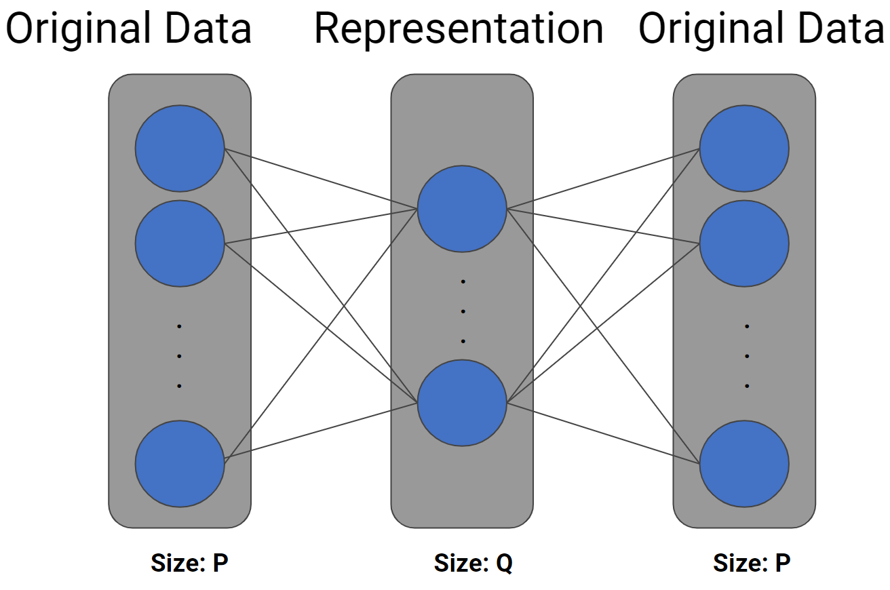

```{r setup, include=FALSE}
knitr::opts_chunk$set(echo = F,message = F,warning = F,fig.align = "center",fig.width=6, fig.height=4)
pacman::p_load(kableExtra,tidyverse,mclust)
source("preprocessing.R")
source("functions.R")
#devtools::install_github("rstudio/keras")
#install.packages("tensorflow")
#library(keras)
library(magrittr)
```


\newpage
\setcounter{tocdepth}{2}
\tableofcontents

\newpage

# Introduction

The initial purpose of this project is to predict the total cost and the expected total cost. The total cost is the total charged from a patient for the curing process; the expected total, on the other hand,  is how much money our client could get given different deductible of the insurance plans for patients. Hence, we thought it could be helpful if our client is able to predict their money matters based on our models.  However, the performances of both regression and classification models on predicting the cost are not as good as what we have expected. Therefore, we move to detect the outliers of the payment records, which can be used to detect if this patient’s record is a potential error after discharging and also useful to preprocess in future data mining projects.\par

For prediction problems, we took payer categories,  body regions, number of outcomes surveys,  admission scores, admission pain, the existence of chronic pain, weeks from surgery or injury date to admission date, weeks from surgery or injury date to the semester, and demographics such as sex, age as potential predictors, and total cost, expected total cost as responses.  For the outlier detecting problem, we only used the number of visits and total expenses.\par

In terms of models, we have tried regression and classification.  In the regression part, we have tried simple linear models and regularized models, but the RMSE is too high, which forced us to the classification problem.  We compared logistic regression, LDA, QDA to a neural network. It turns out the neural network has slight improvements, but in general, it didn’t change a lot. Finally, we moved to the anomaly detecting problem.\par

# Data preprocessing

Through EDA, we found that the raw dataset contains a lot of missing values, and the key (ROS ID) of the two spreadsheets is unmatched. We then took some efforts to clean the data and make some features that we thought might be helpful in our models. Here are some details of how we processed the data. \par
- Remove ROMS ID that contains NA Visit IDs, join two data frames\par
- Impute negative ages by mean \par
- Compute the weeks from injury/surgery to admission (treatment)\par
- Compute the weeks from semester end to  admission (treatment)\par
- Compute how many kinds of Outcome survey conducted \par
- Scale the admission pain to 0-1\par
- Change Surgical levels and drop the non-significant 3rd levels\par
- Create a new feature that combines Surgical and Payer Category together\par
- Change some categorical variables to numeric in order to be more interpretable \par


# Predictive modeling

## Regression

In order to predict the total cost and the expected total cost, we first want to try regression models, we want to use a simple GLM model as the baseline model.\par

1.GLM \par
We fitted simple linear models fisrt,  but the residuals of the models show a clear need to transform our responses and refit. We then fit the log transfomation of the response variables and re-fit the model \par
It turns out that only a few factors contribute some to the results of response variable. The significant varibles here are Surgical (If the Surgical category belongs to 'surgical', the response seems to change a lot), outcome_ct (how many kinds of Outcome survey conducted), admin_pain and admin_score. \par
So, we decided to try regularization with cross-validation to explore more of the predictors and see how the regularized linear models going to be. \par

2. Regularized linear regression\par
We dummized the categorical variables to make the design matrix in order to be able to fit cross-validated ridge regression and lasso regression \par

`Table`.\@ref(tab:regression-1) and `Table`.\@ref(tab:regression-2) showed the results for regression. We compared the results of total cost and the expected total cost respectively on all four models we have fit in regression part, GLM, GLM(log response), Ridge, Lasso, Note that the regularized linear regressions are all based on log response. \par


```{r echo=FALSE}
result_regression_total <- read.csv("result_regression_total.csv")
colnames(result_regression_total) <- c('Linear', 'Linear log(Y)','Ridge', 'Lasso')
rownames(result_regression_total) <- c('RMSE','MAE')
kable(result_regression_total,
      format = "latex",
      booktabs = T,align = "c",
      digits = 2,
      label = "regression-1",
      caption = "Result of Total Expenses")%>%
  kableExtra::kable_styling(bootstrap_options = c("striped", "hover"))
```

```{r echo=FALSE}
result_regression_exptot <- read.csv("result_regression_exptot.csv")
colnames(result_regression_exptot) <- c('Linear', 'Linear log(Y)','Ridge', 'Lasso')
rownames(result_regression_exptot) <- c('RMSE','MAE')
kable(result_regression_exptot,
      format = "latex",
      booktabs = T,align = "c",digits = 2,
      label = "regression-2",
      caption = "Result of Expected Total")%>%
  kableExtra::kable_styling(bootstrap_options = c("striped", "hover"))
```


After trying different features, the results of the regression models are still not ideal. The RMSE of testing data indicates that there is a big deviation between predicted cost and actual cost. Thus, we moved to classification. \par

## Classification 

We have tried classifications with three classes and two classes, for three classes, we have fit ordinal categorical regression; for two classes, we used logistic regression (as well as LDA, QDA). \par
1. Three Classes --- Ordinal categorical regression\par
Based on the distribution of total cost and expected total cost, we have first separated them into three categories and used an ordinal categorical regression. Here is how we classified them:\par
Total cost:  “total<500”,”500<total<2000”, ”total>2000" \par
Expected total cost: "exptot<500", "500<exptot<1000", "exptot>1000" \par
However, the predictive accuracy of ordinal categorical regression is only about 40%-50% for each class, which is even not better than random gussing. Hence, we decided to move our classification to a two class problem. \par

2. Two Classes --- Logistic regression, LDA, QDA, Neural Network.\par
In two-class classification models, we split our response variables based on the following criterion.\par
Total cost:  "total<1200",  "total>1200"\par
Expected total cost: "expected_tot<650", "expected_tot>650"\par
In terms of the results, we compared the overall accuracy and the F1- score of a 10-fold cross-validation for logistic regression, LDA, and QDA on classifying total cost and expected total cost.\par
Here is a summarize of the results. \par

```{r echo=F}
Classification_Results1 <- read.csv("result_total_classification.csv") %>% round(3)
rownames(Classification_Results1) <- c('Accuracy', 'F1-score')
kable(Classification_Results1,
      format = "latex",
      booktabs = T,
      align = "c",digits = 2,
      label = "classification-1",
      caption = "Classification Results of Total Expenses")%>%
  kableExtra::kable_styling(bootstrap_options = c("striped", "hover"))
```
```{r echo=F}
Classification_Results2 <- read.csv("result_exptot_classification.csv") %>% round(3)
rownames(Classification_Results2) <- c('Accuracy', 'F1-score')
kable(Classification_Results2,
      format = "latex",
      booktabs = T,
      align = "c",digits = 2,
      label = "classification-2",
      caption = "Classification Results of Expected Total")%>%
  kableExtra::kable_styling(bootstrap_options = c("striped", "hover"))
```

The overall accuracy for all these two-class prediction models is only about 60%, which is slightly better than random guessing, but it does not help our client a lot. \par


\newpage
# Anomaly Detection

## What could be the driver?

As we are trying to understand the drivers of cost, we figured that the cost almost solely determined by the number of visits, there are only subtle differences between the body region or any other predictors we have in the data.

```{r anomaly-eda, fig.cap = "Visits vs Total Expenses"}
ggplot(md_data_new_1,aes(x = Visits,y = total,color = body_region)) + geom_point() + facet_wrap(~body_region,ncol = 4) + geom_smooth(method = "lm",formula = 'y ~ x',se = F) + theme(legend.position = "")
```

As can be seen in `Figure`.\@ref(fig:anomaly-eda), across almost all the body regions, the visits and expenses are distributed similarly. Besides, from the fitted lines, we could clearly see that the relationship between visits and total expenses are both highly linear and consistent across different patient groups. The same results can be observed through all other predictors, and it is most likely the reason that our previous modeling efforts failed. However, we do found out that in the records there exist some unusual data that does not follow the overall trend. These abnormal records indicated that in the data, there are patients who have a high number of visits but only pay a relatively small amount or the opposite. As discussed with the client, these records are potential errors in the database, so it is worth the effort to design an algorithm to label them out for further investigation.

## Anomaly Detection Algorithm

### Overview

The basic idea behind anomaly detection is rather straight forward. We assume all the normal data would follow similar underlying mechanics, but anomalies will not. So we could learn a compact representation of the normal data's mechanics(either a probability distribution or a subdivision of the original feature space) that can recover the normal data with only a small amount of error(or higher probability in the probability models). Since anomalies do not follow the same mechanics, the learned representation can only capture the part of the data that is similar to the normal ones but loses a sizable portion of the information. So it will introduce a noticeable reconstruction error(or very low probability density) in the anomalies.

Besides all the automatic part, for all the detection methods, we need to choose a decision threshold manually. Right now, all the thresholds are set according to $3\sigma$ rules^[3 standard deviations of the reconstruction error distribution or beyond 99.9% percent of a probability distribution]. These thresholds are, in a sense, arbitrary. One should check the labeling in the real application scenario and tune the thresholds using the F1 score.

In this project, we applied the Gaussian mixture model to perform the initial labeling. Then we used PCA and autoencoder to achieve more adequate labeling rules.


### Gaussian Mixture 


The Gaussian mixture model estimates the most likely normal distribution over the data points. The decision boundary is achieved by setting up a threshold density. Points with a density lower than the threshold will be considered as anomalies. The decision boundary obtained by Gaussian mixture is an eclipse as shown in `Figure`.\@ref(fig:gaussian-mixture) and `Figure`.\@ref(fig:gaussian-mixture-res), the closer to the eclipse center would have larger density. This method is a good initial guess because it could capture the data's 'center of mass'. Further modeling could be applied upon the result of the Gaussian mixture.

```{r}
library(mclust)

all_data <- md_data_new_1 %>% 
  dplyr::select(Visits, total) %>% as.matrix()

all_data <- scale(all_data)
col_mean_train <- attr(all_data,"scaled:center")
col_sdev_train <- attr(all_data,"scaled:scale")
em_data <- densityMclust(all_data,G = 1,modelNames = "VVV")
```

```{r gaussian-mixture, fig.cap = "Gaussian Mixture Estimation",out.width = "80%"}
plot.densityMclust(em_data,what = "density", type = "persp", col = grey(0.9))
#points(all_data[!em_data$density<0.00001, ],col = "skyblue",cex = .5)
#points(all_data[em_data$density<0.00001, ],col = "darkgreen",cex = 1)
```

```{r gaussian-mixture-res, fig.cap="Anomalies labeled by Gaussian Mixture",out.width = "60%"}
#plot(predict(em_data,newdata = anomaly_data, what = "dens"))
md_data_new_1$Outlier <- em_data$density<0.00001

ggplot(md_data_new_1,aes(x = Visits, y = total, color = Outlier)) + geom_point() + labs(title = "Initial Labeling through Gaussian Mixture")
#ggsave("Inital.png",dpi = 300)


x = seq(0,80,by = 1)
y = seq(0,16000,by = 100)


grid <- expand.grid(x,y) %>% rename("Visits" = "Var1",
                                    "total" = "Var2")
grid_scale <- scale(grid %>% as.matrix(),center = col_mean_train,scale = col_sdev_train)

GM_pred <- predict.densityMclust(em_data,newdata = grid_scale,what = "dens")
grid$Outlier <- GM_pred<0.00001
#ggplot(grid,aes(x = Visits, y = total, color = Outlier)) + geom_point()+ labs(title = "Decision Boundary")
#ggsave("Inital_DB.png",dpi = 300)
```

The limitation of the Gaussian mixture is also obvious because it assumes that the data will have a single concentrated point. Thus it does not allow a large distance from the assumed center. In this case, all the data points that have a large number of visits will be labeled as anomalies, although a good size of them clearly follows the same linear trend.

### PCA 


In the next step, we used the normal data labeled by the previous model and applied both PCA^[**P**rinciple **C**omponent **A**nalysis] and autoencoder to obtain new decision boundaries.

The reason we choose PCA is to address the linear trend between visits and total expenses. PCA finds a combination of linear directions that capture the largest variation in the data. When using a subset of the PCA directions, one can construct a compact representation of the original with a small amount of information loss. Datapoint that follows the PCA direction will have less reconstruction error than those who do not.  The decision boundary of PCA would be a straight line, as shown in `Figure`.\@ref(fig:pca-1). More intuitively, points that are within a fixed length of the PCA direction will be considered as normal data. This setup allows higher than usual visits as long as the cost follows the same linear trend as the more frequent number of visits.

```{r}
anomaly_index <- em_data$density<0.00001
train_data <- all_data[!anomaly_index, ]
pc <- princomp(train_data,cor = F)
# summary(pc)
# plot(pc)

scores <- pc$scores

test_scores <- train_data %*% pc$loadings[ ,1]

loading_t <- t(pc$loadings[, 1])


reconstruct <- test_scores %*% loading_t


recon_error <- apply((train_data - reconstruct)^2,1,mean)


test_outlier <- all_data %*% pc$loadings[ ,1] %*% loading_t


recon_error_outlier <- apply((all_data - test_outlier)^2,1,mean)
sd_recon <- sd(recon_error_outlier)

md_data_new_1$pc_outlier <- recon_error_outlier > 2*sd_recon

#write_csv(md_data_new_1 %>% select(`ROMS ID`,Visits,total,pc_outlier),"pc_Outliers.csv")

# ggplot(md_data_new_1,aes(x = Visits, y = total, color = pc_outlier)) + 
#   geom_point()+
#   labs(color = "Outlier",title = "1st PCA iteration")
# ggsave("PCA_1st.png",dpi = 300)

grid_pred <- grid_scale %*% pc$loadings[ ,1] %*% loading_t
grid_label <- apply((grid_pred - grid_scale)^2,1,mean) > 2*sd_recon
grid$Outlier <- grid_label
```

```{r pca-1,fig.cap = "Decision boundary CAlculated by PCA",out.width = "60%"}


ggplot(grid,aes(x = Visits, y = total, color = Outlier)) + geom_point()+ labs(title = "Decision Boundary by PCA",
                                                                              subtitle ="Threshold: 3 standard deviation of reconstruction error" )
#ggsave("PCA_1st_DB.png",dpi = 300)
```

### Autoencoder


Autoencoder is a method based on the neural network, unlike other methods that make explicit assumptions about the distribution of the normal data and anomalies(gaussian assume a probability distribution, PCA assume normal data follows a common direction, etc.). This method does not explicitly assume any form of normal data. Instead, it implicitly learns the compact representation for the normal data as long as the architecture is correctly specified.

`Figure`.\@ref(fig:autoencoder-1) showed a simple generic architecture of autoencoders. The network learns the compact representation by setting the size of the representation layer smaller than the original data. If one feeds the network with all the normal data, it will be able to learn the normal pattern, and the network is able to reconstruct the feed-in data with a low reconstruction error. When anomalies are fed, the same reconstruction pattern learned by the network will fail to reconstruct the input data accurately because the pattern is not followed by the anomalies.

```{r autoencoder-1, echo=FALSE, fig.cap="Generic Stucture of Autoencoder",fig.align='center',out.width="60%"}

```

Similar to PCA, one could choose a proper reconstruction error threshold to label all the anomalies. However, because of the relaxed assumption by autoencoder, the decision boundary obtained is not stable. In our case, the decision boundary calculated jumps between the result from the Gaussian mixture and PCA.


Because autoencoder can learn a very complex hidden structure of the data, to achieve a robust result, a cleaned training set is often required. As a result, it will be better to apply this method after we have obtained a clean dataset through other traditional methods.

### Results


As we can see from `Figure`.\@ref(fig:anomaly-res), our method is able to correctly identify all the questionable datapoints in the original data.

```{r anomaly-res, fig.cap = "Anomaly Detection Result"}
ggplot(md_data_new_1,aes(x = Visits,y = total,color = body_region)) + geom_point(aes(shape = pc_outlier)) + facet_wrap(~body_region,ncol = 4) + geom_smooth(method = "lm",formula = 'y ~ x',se = F) + theme(legend.position = "")+scale_shape_manual(values=c(1,4)) + labs(subtitle = "Anomalies are labeled as cross")
```


# Conclusion and Discussions

In this project, we first tried and showed that the number of visits determines a patient's total expense. The information available at the point of admission is weakly related to the eventual number of visits.

However, as we dug into the data, we found out there exist abnormal patient records. We showed that these abnormal records could be identified through our proposed anomaly detection methods. 

As the method we proposed is fairly generic. The same procedure could be applied to more variables and different anomaly detection scenarios.

We think that this method would have two major applications:

1. This model can be used to evaluate a patient's record at the point of discharge to identify any potential payment errors.
2. This model can be served as a preprocessing step for any future projects regarding this dataset.

To fulfill the two applications, we strongly recommend checking the model results and work out a better threshold for anomaly labeling.


 


